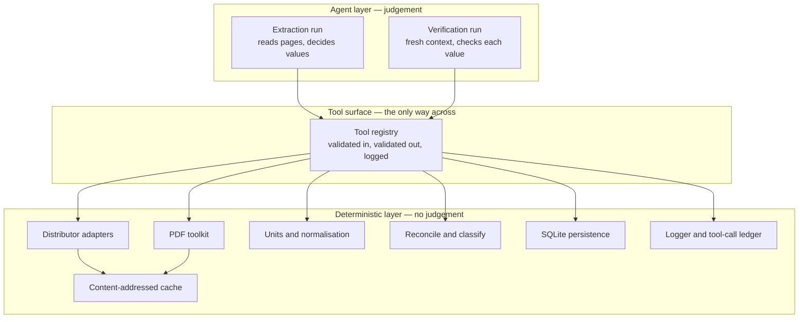
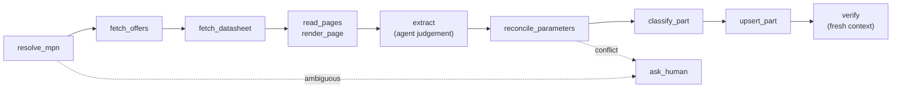

# Architecture

How the system is put together: the pieces, what each one owns, and how they
interact. `CLAUDE.md` states the rules this design serves;
`docs/COMPLETION_PLAN.md` tracks what is built.

Status marks in this document are accurate as of 2026-09-11: **built** means
implemented with full tests and passing CI, **in progress** means partially
implemented, **planned** means designed here but not yet written.

A rendered version with the diagrams drawn is published at
<https://claude.ai/code/artifact/917a3125-6999-40cd-b5f7-c57e1196cc37>. Its
source is `docs/architecture.html`, which is committed alongside this file and
excluded from formatting so it stays byte-identical to what is deployed. This
Markdown file remains the source of record; update it first, then the page.

## 1. The shape of the problem

Given a chip part number, produce a record of that part that a hardware
engineer can trust: electrical parameters, where each one came from, what it
costs, and how it is categorised. Then answer questions across those records,
such as finding a cheaper alternate that still meets a Vin range.

Two properties make this hard, and they drive the whole design.

**Datasheets are not data.** A PDF is a rendering, not a database. Values live
in tables that lose their structure when extracted as text, one datasheet
usually covers a whole family of part numbers, and the part number suffix that
distinguishes them encodes packaging and temperature grade rather than
anything electrical.

**A wrong answer is worse than no answer.** A misread maximum input voltage
does not produce a slightly worse recommendation; it produces a dead board. So
every value carries where it came from, nothing is coerced into fitting, and
anything ambiguous stops and asks.

## 2. Two layers

The system is split in half, and the split is enforced by module boundaries
rather than convention.



**The deterministic layer** fetches, parses, converts, stores. Given the same
inputs it produces the same outputs, every time, with no model in the loop. It
is ordinary software and it is tested as such: 1153 tests at 100% coverage.

**The agent layer** does the one thing that genuinely needs judgement: reading
a datasheet page and deciding what the numbers mean. It never touches the
filesystem, the database, or the network directly. Everything it does goes
through the tool surface, where inputs and outputs are validated and every
call is recorded.

The reason for the strict split is that the deterministic layer can be proven
correct by tests, while the agent layer can only be measured statistically
against a golden set. Keeping them apart means a failure lands on one side or
the other, and the eval measures only the part that actually varies.

## 3. The pipeline

One part flows through these stages. Each is a separate tool call, so each is
individually cached, logged, and re-runnable.



1. **Resolve** the raw part number to a specific part, decoding its suffix and
   matching distributor listings. Ambiguity escalates rather than guessing.
2. **Fetch offers** from distributors: pricing, stock, packaging, and the
   parametric data they publish.
3. **Fetch the datasheet** PDF, by content hash, cached on disk.
4. **Read** the pages that matter. Text first; when the page metrics say a
   table has lost its labels, render it as an image and read it visually.
5. **Extract** parameters. This is the agent's real work. Every value must
   cite a page number.
6. **Reconcile** the extracted values against distributor parametrics.
   Agreement raises confidence; disagreement on a safety-relevant parameter
   always escalates.
7. **Classify** along fixed axes with deterministic rules.
8. **Persist**, with the whole aggregate validated as one unit.
9. **Verify** in a fresh context that has never seen the extraction
   transcript, checking each stored value against its cited page.

Step 9 is separate on purpose. A model asked to check its own work in the same
context will agree with itself. A model given only a page and a claim will not.

## 4. The pieces

### Foundation (`src/config.ts`, `src/errors.ts`, `src/util/`) — built

`loadConfig` validates the environment once at startup and returns a deeply
frozen object, failing with every problem listed at once rather than one at a
time. Credentials are optional at load time and demanded by the adapter that
needs them, so the PDF and database layers run with no keys configured.

Every deliberate failure is a `ChipAgentError` with a stable `code` string.
Callers branch on the code, never on message text. The error serialises
without a stack, so it can go straight into the ledger.

`src/util/` holds two small helpers with an unusual purpose: `group` for regex
captures and `elementAt` for array indices. Strict TypeScript types every
indexed access as possibly undefined, which would otherwise force an
unreachable `?? ''` at every use. These turn that into a real, tested error, so
an off-by-one fails loudly instead of silently substituting a default.

### Core schemas (`src/core/`) — built

The vocabulary of the whole system, as Zod schemas. Everything else imports
from here, and every boundary parses rather than casts.

The central type is `Part`: a part number, its manufacturer, thirty
buck-regulator parameters, its datasheet, its offers, its classifications, its
verifications, and a status. Each parameter is not a bare number but a
`{ value, provenance, confidence }` triple.

Three rules are enforced by the schema itself, not by discipline:

- A value sourced from a datasheet **must** carry a page number. There is no
  shape for a datasheet-sourced value without one.
- Quantities are `{ value: number, unit }` with the unit pinned per field. The
  string `"3 V to 32 V"` is not a quantity and is rejected, never parsed.
- A range is `{ unit, min, max, typ? }` and is never silently collapsed to a
  single value, nor a single value promoted to a range.

`Part` also carries cross-field invariants: a parameter citing a datasheet
must cite *this* part's datasheet on a page it actually has; a part with any
parameter in conflict cannot be `verified`; one classification per axis.

### Logging and the ledger (`src/log/`) — built

Two separate concerns that share a redaction path.

The **logger** writes one JSON object per line to stderr. Never stdout, which
belongs to the MCP transport; a single stray line there corrupts the protocol.

The **ledger** is the more important half. Every tool call is appended to a
daily JSONL file with its inputs and outputs. This is not debugging output: it
is the eval dataset, and it cannot be reconstructed after the fact. Writes are
queued so concurrent calls never interleave, oversized outputs spill to
content-addressed blob files, and every record is schema-validated before it
lands. `withLedger` wraps a handler so a tool cannot be registered without
being recorded.

Redaction runs over everything: known secret values, secret-shaped patterns,
and values under secret-looking keys, with errors, dates, and cycles reduced
to JSON-safe forms.

### Cache (`src/cache/`) — built

The single seam between the deterministic layer and the network, and the
reason prompt iteration is free.

A request is identified by a namespace and its JSON parameters, hashed with
keys sorted at every level so ordering never matters. `Cache.cached(key,
fetch, options)` returns the stored value when it is present and unexpired,
otherwise calls `fetch` and stores the result. Concurrent calls for the same
key share one fetch.

One detail matters more than it looks: after a fetch, the value returned is
the *decoded stored bytes*, not the in-memory object. The first run and every
rerun therefore see exactly the same thing, including any lossy round trip.

`CacheStore` is an interface with a sharded, atomic file implementation.
Swapping it for S3 is one class, which is why it exists as an interface now
rather than later.

### Persistence (`src/db/`) — built

SQLite through `better-sqlite3`, behind repositories. Migrations are numbered
TypeScript modules holding SQL, applied in a transaction, tracked in a table,
and a migration that fails rolls back completely.

`upsertPart` is where the reject-never-coerce rule becomes real. It parses the
entire aggregate first and throws with every issue listed; only then does it
write, replacing child rows so what is stored is exactly what was given.

Parameters are stored one row per parameter with the value as JSON *and* with
numeric bounds extracted into columns, which is what makes the alternates
query possible: "every part whose Vin range covers 8 to 36 volts" is a SQL
filter, not a scan.

The Nexar budget lives here too, as a single row updated inside an immediate
transaction, so two connections cannot both slip under the lifetime limit.

### Units (`src/units/`) — built

Everything needed to turn what a datasheet or a distributor says into a
comparable number, and nothing else. Pure functions, no I/O.

Text is normalised first: unicode minus signs, exotic spaces, split unit
spellings such as `deg C`, thousands separators, and `3V3` shorthand. Then a
unit table resolves aliases and SI prefixes. Then the parsers produce a
quantity or a range, or throw with a reason. They never return `NaN` and never
guess a missing unit.

Numbers are built from their decimal text and the prefix exponent rather than
by multiplication, so `70 µA` is exactly `0.00007` and formatting round-trips
exactly. Property tests prove that round trip for every unit.

The distributor mapping tables live here as well, turning parametric names
into schema keys. A name with no mapping is reported, never dropped, so the
tables grow from real data rather than guesswork.

### PDF toolkit (`src/pdf/`) — built

Poppler wrapped in a subprocess runner with a timeout, an output cap, and
typed failures.

`fetchPdf` downloads through the cache, following redirects, retrying with
backoff, enforcing a size cap, and checking both the content type and the
`%PDF-` magic bytes. The cached file *is* the local path handed onward.

`readPages` extracts one page at a time and caches per page. Alongside the
text it returns **page metrics**: line counts, columns detected by whitespace
runs, numeric token counts, and how many lines hold numbers with no label.
Those numbers exist so the agent can decide to render a page as an image
without exercising judgement about it, which keeps a judgement call out of the
deterministic layer.

`renderPage` produces a PNG at a chosen resolution, cached. `findPages`
locates the sections that matter, including ordering information, because one
datasheet usually covers a family and the ordering table is what says which
part numbers.

### Distributor adapters (`src/adapters/`) — Digi-Key and Mouser built

Each adapter owns its authentication, request layer, response schemas, and the
mapping to core types. All of them share three properties: every call goes
through the cache, every call is recorded in the ledger, and responses are
validated before they leave the adapter.

**Digi-Key** is the primary source: rich parametrics, pricing per packaging
variant, and a datasheet URL. Authentication is the 2-legged client
credentials flow, and the access token lives only 600 seconds, so the token
client refreshes ahead of expiry rather than reacting to a 401. Requests are
serialised with a minimum gap so a burst cannot trip the rate limit, and the
daily quota reported in the response headers is tracked. `lookup(mpn)` spends
one request where the obvious three calls would spend three, because product
details already carries pricing, parametrics, and the datasheet URL.

Response objects are deliberately *loose*: Digi-Key adds fields over time and
an unknown field is not a reason to fail. Every field the adapter reads is
declared, so one that changes type does fail.

One product yields several offers, one per packaging variant, each with its
own Digi-Key SKU, stock, minimum order quantity, and price breaks.

**Mouser** is a second opinion on price and availability, and nothing more:
its Search API publishes only packaging attributes for switching regulators,
so the adapter maps none of them rather than inventing parametric data. Two of
its behaviours shape the client. A rejected request still returns HTTP 200 with
an errors array, so status alone never means success, and prices arrive as
formatted strings in the account's currency, which need not match the one
Digi-Key was asked for.

**Nexar** (planned) is cross-distributor and returns datasheet URLs directly,
but its evaluation tier allows 100 parts for the lifetime of the account. It
is therefore disabled by default and every operation reserves from the
persisted budget counter *before* any network call, so the limit cannot be
exceeded even by a bug.

### MPN resolution (`src/mpn/`)

Normalise the raw part number, decode the manufacturer suffix into base part,
package, temperature grade, and packaging, then match against distributor
listings. An unknown suffix decodes to nothing rather than a partial guess.

Exact match wins. A base-part match differing only in packaging is a variant
of the same part. A base-part match differing in package or temperature grade
is a *sibling*, not a match, and several plausible candidates escalate.

Digi-Key's `BaseProductNumber` field gives the family part number directly,
which corroborates the decoded suffix rather than replacing it.

### Reconciliation and classification (`src/reconcile/`, `src/classify/`)

Reconciliation compares each extracted value with the distributor's, using
per-parameter tolerances. Outcomes are agreement, conflict, or present on only
one side.

The asymmetry that matters: a conflict on a safety-relevant parameter, such as
absolute maximum input voltage or maximum output current, always escalates and
is never auto-resolved. A conflict elsewhere keeps the datasheet value, records
the distributor's alongside it on the parameter, and marks the parameter as in
conflict, which by the `Part` schema forces the part out of `verified` status.

Nothing is adopted from a distributor. A value the datasheet did not state is
reported as `distributor_only` for the agent to act on, never written in: a
value with no page behind it is not an extracted value.

Three decisions carry most of the weight:

- **A value nobody could compare corroborates nothing.** Where a comparison is
  impossible — a package text naming no shape — the outcome is
  `datasheet_only` with the observation recorded, not agreement.
- **Packages are compared as shapes, not words.** `8-PowerSOIC (0.154",
  3.90mm Width)` and `8-SOIC PowerPAD (DDA)` are one package written twice.
- **Several observations of one parameter combine per parameter.** Two
  distributors are two readings of one part, so either disagreeing is a
  conflict; Digi-Key's two package fields are two descriptions of one thing,
  and its own fields disagree on 9 of 547 recorded parts, so one agreeing
  settles it.

Classification is a set of pure functions, each with an identifier, producing
fixed axes: input voltage class, output current class, topology, integration,
output type, package family, temperature grade, and a feature set. Every
classification records which parameters it was derived from and which rule
produced it. An axis whose parameters are missing, or whose values decide no
value on that axis, is reported as undecided rather than guessed: `classify`
returns every axis or a typed error naming what it could not decide.

### Tool surface and MCP (`src/tools/`, `src/mcp/`)

Tool handlers are transport-agnostic functions with Zod schemas on both input
and output. The registry refuses duplicate names and wraps every handler with
ledger recording and output validation: a handler that returns something
failing its own output schema is a bug and throws, with a different code from
a caller's bad input.

The same registry is exposed twice. As a **stdio MCP server** for external
clients such as Claude Code or the MCP Inspector, and as an **in-process SDK
server** for the agent runner. One implementation, two thin adapters, and a
test asserts both expose identical tool lists — each by connecting a client
and asking, because a tool list that cannot be serialised is a surface that
does not exist (D48).

What the server advertises is what it enforces: strict input schemas, so an
argument the tool does not take is refused with the key in the message rather
than dropped on the way in. A failure comes back as an error result carrying
the code, because the model is meant to read it and decide what to do next.

**Spending is gated by running the real call under a cache-only mode.** A tool
that can spend distributor quota accepts `confirmSpend`; without it, the call
runs against the cache alone, and only a question that would actually cost
something comes back as `needs_confirmation` with the input to resend. The
policy deciding this is a separate object, so the agent runner sets it per run
and the tools never know why. Nothing predicts what is cached: the free path
is the same code as the spending path, so the two cannot disagree.

### Agent runner (`src/agent/`) — built

Two runs on the Claude Agent SDK, sharing nothing.

The **extraction run** gets the in-process tool server, every built-in tool
disabled, no settings files, a turn limit, a cost ceiling, and a `PreToolUse`
hook. The hook is the second of three parts of the money gate: it inspects
each tool call and denies a spend the run has no budget for, rewrites the
input to confirm one it does, and lets an unconfirmed call through to answer
from the cache (D49). The server-side flag protects against every client; the
hook protects against this particular agent; `maxBudgetUsd` protects against
both, because the agent cannot reach it. Three, because one is not enough.

Every run writes a `runs` row before its first message and completes it after
its last, so a run that never came back is a row with no result rather than
nothing at all. The result is the run's achievement for the part —
`extracted`, `needs_human`, `rejected` — and the details beside it say what
it did: how many tool calls, which failed, how many spends were refused,
whether a part was stored. The ledger holds the condensed transcript, with
every tool call and gate decision recorded as a child of the run's own entry.
That parent id is how one run's calls are counted among a batch's.

A failed run is not an exception. A harness that crashed, a model that ran out
of turns and a part stored cleanly are all endings, recorded the same way.
`extractPart` throws only when the run could not be set up at all.

A tool schema has to survive two conversions, not one: the MCP server's and
the Agent SDK's. The SDK bundles an older MCP SDK whose JSON Schema
conversion cannot express a Zod record, and one tool it cannot convert empties
the whole tool list — the model then has no tools and says so by writing tool
calls as prose (D48). The in-process server is therefore listed and called
over a real connection in the tests, not through its handlers.

The **verification run** takes a part identifier, not a session, and starts
fresh. Its isolation is structural rather than a matter of prompt discipline:
there is no parameter through which the extraction transcript could reach it,
and a test asserts the fake harness receives no resumed session. It gets three
tools — read a page, render a page, record a verdict — and no way to change
anything. What happens to the part is decided from the verdicts afterwards, by
a pure function: confirmed becomes verified, contradicted becomes a conflict
and a question, and a safety rating nobody can find on its page is treated as
a contradiction.

The verdicts travel back with the part when it is written, because storing a
part replaces its child rows and a pass that wrote the part back without them
would erase its own work (D53).

The first real pass confirmed 29 of 30 values and found that the extraction
had cited the wrong page for the thirtieth — a value that was right, with
provenance that was not. Nothing in the extraction run could have noticed, and
that is the whole argument for the second context.

### Golden set and evaluation (`eval/`, `src/eval/`)

Twenty-one buck regulators read datasheet by datasheet, every value carrying
the page it came from and every null carrying a note saying what the page
holds instead. Six of the datasheets cover more than one part in the set,
which is the case the whole project exists for.

The scorer compares an extraction with a golden part per parameter:
`correct`, `wrong`, `missing`, `extra` and `absent`. **`extra` is scored
apart from `wrong`** — a value invented where the datasheet says nothing is a
different failure from one misread — and citations are scored apart from
values, with a bucket for landing one page away.

Numbers are compared with the same per-parameter tolerance reconciliation
uses, so "correct" means one thing in both places.

The readings are the model's own, made deliberately page by page rather than
by the pipeline under test. That makes the set a regression net and a floor,
not an independent reference: a misreading that comes from how the model
reads would appear on both sides. The files say so, and a human review is the
open question that would change it.

### Alternates query (`src/query/`) — planned

The end goal. Filter by constraints, rank by unit price at the requested
quantity, and return a per-parameter comparison against the reference part.

Every result carries a mandatory statement that pin compatibility has not been
assessed, because parametric similarity does not imply a drop-in replacement,
and a table of numbers invites exactly that assumption.

## 5. How the pieces interact

### The cache is the only door to the network

```
adapter / pdf toolkit  →  Cache.cached(key, fetch)  →  CacheStore  →  disk
                                    ↓ on miss only
                                  network
```

Nothing else calls `fetch`. This is why a rerun costs nothing, why the eval
harness can treat a cache miss as a failure, and why moving to S3 later is a
single implementation swap.

### The ledger is the only record

Every tool call is begun before its handler runs and ended with its output or
its error. The record includes the session, the tool, the input, the output,
the duration, and whether it was allowed to spend quota. It is append-only.

### Provenance flows with the value, not beside it

A parameter is never a bare number anywhere in the system. It carries its
provenance from the moment it is created, through reconciliation, into the
database, and out again. There is no stage at which a value exists without
knowing where it came from, because there is no type for that.

### Escalation is a first-class outcome

`ask_human` writes an escalation and returns; it never blocks. The part is
marked as needing a human and the run ends cleanly. Escalations are stored,
listed, and resolved with a record of who answered and when. A run that
escalates has succeeded at its actual job, which is to avoid asserting
something it cannot support.

## 6. On-disk layout

```
DATA_DIR/
├── cache/<namespace>/ab/cd/<hash>        the cached bytes
│                          <hash>.meta.json   metadata sidecar
├── ledger/YYYY-MM-DD.jsonl               one line per tool call
│         blobs/<sha256>.json             oversized tool outputs
├── tokens/digikey.json                   access token, mode 0600
└── chip.sqlite                           parts, offers, escalations, runs
```

Nothing here is committed. `.env` holds credentials and is gitignored; the
config loader is the only thing that reads it, and the redactor keeps its
values out of the logs and the ledger.

## 7. Error taxonomy

Every module defines its own subclass of `ChipAgentError` with codes prefixed
by area: `CONFIG_`, `VALIDATION_`, `CACHE_`, `DB_`, `LEDGER_`, `UNIT_`,
`SUBPROCESS_`, `POPPLER_`, `PDF_`, `DIGIKEY_`. A code is a contract; callers
branch on it, and a test asserts the code rather than the message.

Two codes carry particular weight. `VALIDATION_FAILED` means something tried
to store a value that does not fit the schema, and it lists every issue with
its path and the value received. `NEXAR_BUDGET_EXHAUSTED` means a hard
lifetime limit would have been exceeded, and nothing was changed.

## 8. What holds the whole thing together

Four rules, from `CLAUDE.md`, each with a mechanism rather than an intention:

| Rule | Mechanism |
| --- | --- |
| Every parameter carries provenance | No schema exists for a value without it |
| Validate and reject, never coerce | `upsertPart` parses the whole aggregate before writing |
| Escalate, don't guess | Conflicts on safety parameters force `needs_human` by schema |
| Log every tool call | `withLedger` wraps registration, not call sites |

And three engineering standards, from the project's own decisions: modules are
finished completely before the next begins, coverage is 100% per file with the
build failing otherwise, and no tool in the pipeline may emit a warning.

## 9. Deferred

AWS hosting is designed for and not built: Fargate for the runner, S3 behind
`CacheStore`, Secrets Manager in place of `.env`, SQS for a work queue, and
Postgres behind the same repository interfaces. Each of those is a swap at an
existing seam, which is the point of the seams. None of it happens until the
system runs reliably on one machine.
